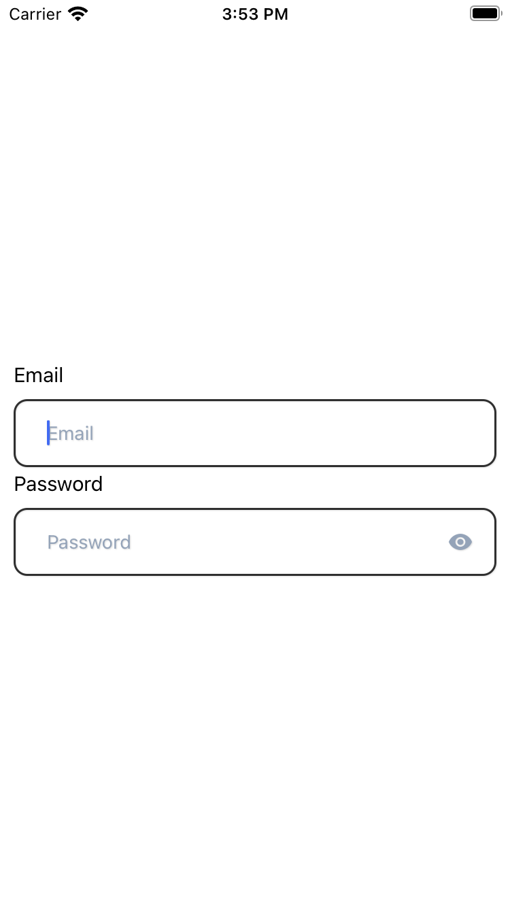
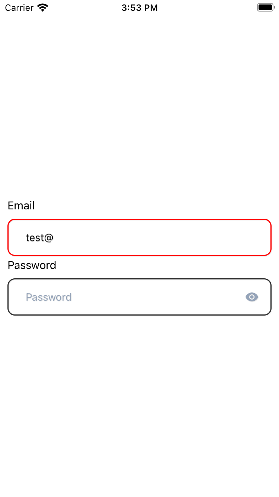
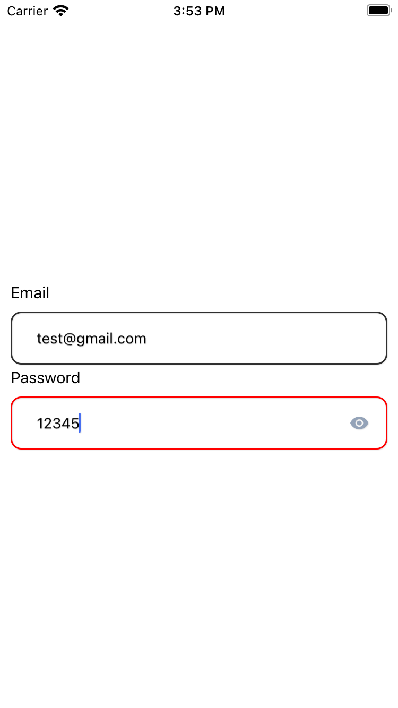
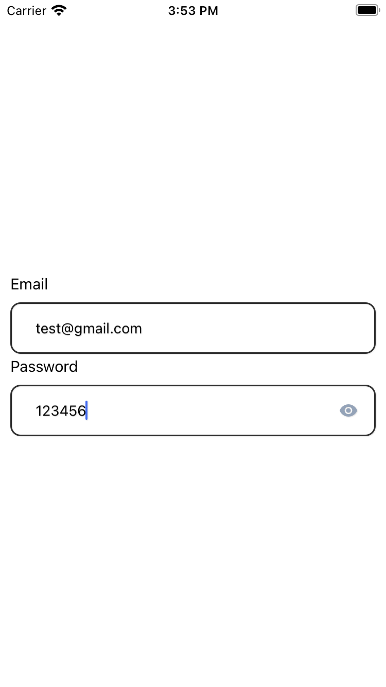
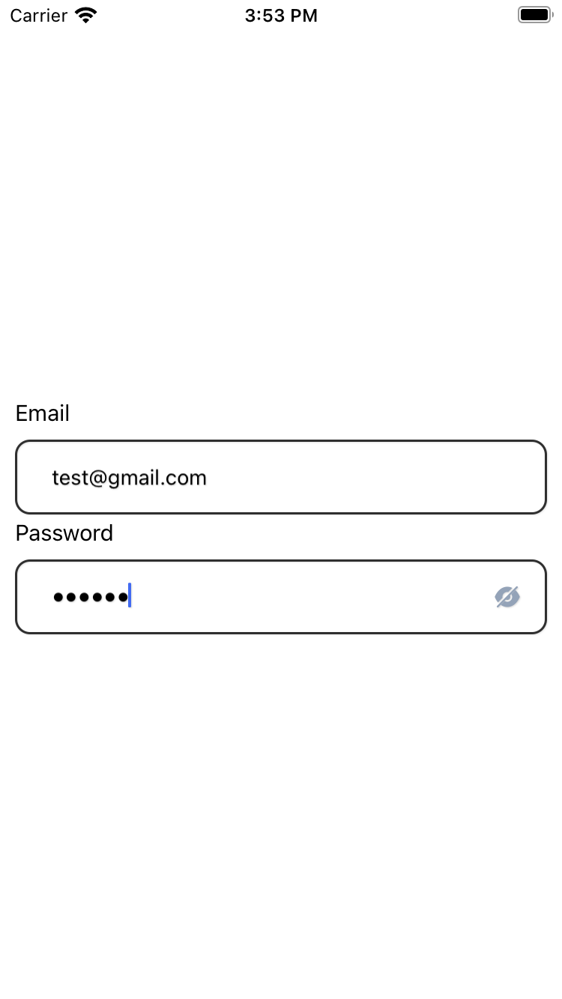

# react-native-inputtext-roundconner
=======

# React Native Email and Password Input Components

<!-- | | | 
|:-------------------------:|:-------------------------:|:-------------------------:|
| |  |  |
|  |   -->

<div style="display: flex; justify-content: space-between; margin: 10px;">
  
  
  
</div>

<div style="display: flex; justify-content: space-between; margin: 10px;">
  
  
</div>

This repository contains reusable React Native components for handling email and password input fields. The components provide features like validation, show/hide password functionality, and customizable styling.

## Components

### 1. `EmailInputText`

A component for handling email input. It includes:

- Email validation
- Customizable title, placeholder, and styles
- Conditional styling based on email validity and editability
- Show/hide password functionality (optional)

#### Usage Example:

```jsx
import { EmailInputText } from './path/to/EmailInputText';

// Inside your component
<EmailInputText
  title="Email"
  placeholder="Enter your email"
  keyboardType="email-address"
  autoCapitalize="none"
  value={emailValue}
  onChangeText={(newEmail) => setEmailValue(newEmail)}
  maxLength={50}
  // Additional props can be passed
/>
```

### 2. `PwdInputText`

A component for handling password input. It includes:

- Customizable title, placeholder, and styles
- Conditional styling based on password validity and editability
- Show/hide password functionality (optional)

#### Usage Example:

```jsx
import { PwdInputText } from './path/to/PwdInputText';

// Inside your component
<PwdInputText
  title="Password"
  placeholder="Enter your password"
  secureTextEntry={true}
  value={passwordValue}
  onChangeText={(newPassword) => setPasswordValue(newPassword)}
  maxLength={50}
  // Additional props can be passed
/>
```

## Styling

The components come with default styling that can be customized. Styling options include border color, background color, and more.
